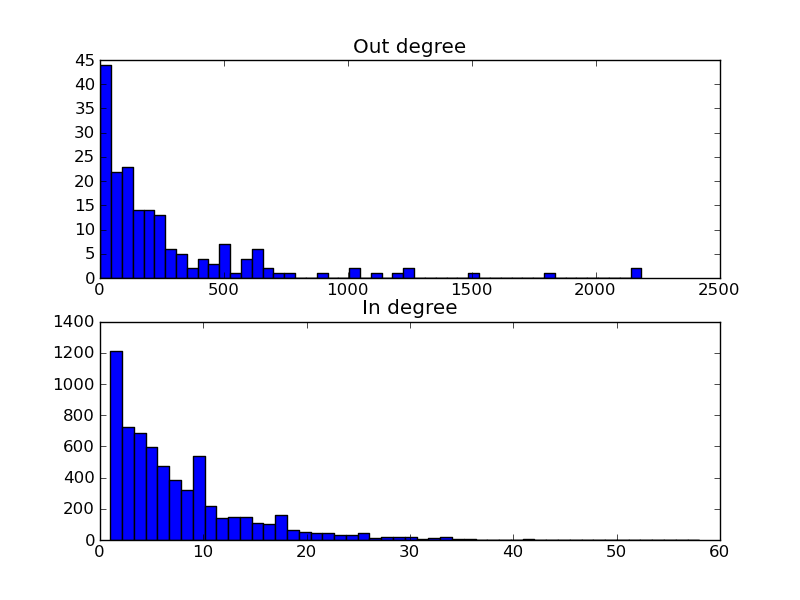

Tutorial
========

In/out-degree distribution of a transcriptional network
--------------------------------------------------------------------------

In the first example, we will look at the network properties of the yeast transcriptional network.
For that purpose, we obtain regulations from www.yeastract.com > Flat Files > RegulationTwoColumnTable

Loading the data
~~~~~~~~~~~~~~~~
To get the data into Ibidas we perform the following operations::

    >>> url = "http://www.yeastract.com/download/RegulationTwoColumnTable_Documented_20101213.tsv.gz"
    >>> yeastract = Read(Fetch(url))

``Fetch`` is an operation that takes a url, downloads the file to the data directory (default ~/.ibidas/data/),
assigns it a file name, and returns this filename. Executing ``Fetch`` on this url again will just return the filename of the
cached local copy. 

Subsequently, ``Read`` takes this filename, and imports the data. By
default it assumes a comma/tab/other symbol separated value file. It will attempt to detect the column delimiter, 
availability of fieldnames and existence of comment lines automatically. 

After these two operations, the contents of yeastract look like this::    
    >>> yeastract
    Slices: | f0       | f1      
    -----------------------------
    Type:   | bytes[7] | bytes[9]
    Dims:   | d1:48082 | d1:48082
    Data:   |          |         
            | Abf1     | YKL112w 
            | Abf1     | YAL054c 
            | Abf1     | YGL234w 
            | ...      | ...

Note that this file did not have fieldnames, so slice names as well as slice types and slice dimensions (will be explained later) where 
determined automatically. The left column (slice ``f0``) contains transcription factors, while the right column (slice ``f1``) 
contains the targets. Note that transcription factor `Abf` is repeated multiple times in this file, as it has multiple targets. 

Looking at the types of both slices, we see that this has been detected as the ``bytes`` type. 
Furthermore, the ``bytes`` type has an extra specifier ``[7]``, indicating that this is the maximum length of the entries in the corresponding slice.

.. tip:: the ``bytes`` type corresponds to the default ``str`` type in Python 2.x. In Python 3.0 the default string type has become
   unicode, and ``str`` has been renamed to ``bytes``. In Ibidas we use the same naming scheme: ``bytes`` for the old str type, and
   ``string`` for unicode strings. 

The third attribute, Dims, describes the structure of the data in a slice. We see that both slices have a single dimension.
This means that the data is structured in a way similar to a `vector`. A slice without dimensions would correspond to a `scalar` value, 
while a slice with two fixed dimensions would correspond to a `matrix` structure. In this case, both slices share the same dimension ``d1``, indicating that
the shape and ordering of elements in both slices are shared. The ``:48082`` describes the shape of the dimension, indicating
that there are 48082 rows.

Of course, using meaningless names, such as ``f0``, is not very handy, so we first assign more suitable names::
    
    >>> yeastract = yeastract/('trans_factor','target')

While we are at it, we also assing a more suitable dimension name::

    >>> yeastract = yeastract%'tftargets'

Note that we reuse the division operator and the modulo operator to assing these names. The reason for this is that 
naming slices is an relatively often recurring action. It is however also possible to use instead a regular function, e.g::

    >>> yeastract = yeastract.Rename('trans_factor','target')

Renaming slices and dimensions is not always necessary, many data sources already assign names of the various data elements. E.g. databases have a table name which
can be used as dimension name, while the column names can be used as a slice names.

.. tip:: You may have noted that operations in Ibidas start with an uppercase letter. The reaseon for this is to separate them from
   slice names and dimension names, which have to be always in lower case. I.e. data.count would refer to the slice count, while
   data.Count refers to the operation ``Count``.

After renaming, our data now looks like::
    >>> yeastract
    Slices: | trans_factor    | target
    -------------------------------------------
    Type:   | bytes[7]        | bytes[9]
    Dims:   | tftargets:48082 | tftargets:48082
    Data:   |                 |
            | Abf1            | YKL112w
            | Abf1            | YAL054c
            | Abf1            | YGL234w
            | ...             | ...

You might have found that there is a very small delay before the contents are printed. The reason for this is the lazy nature of 
Ibidas. That is, Read and all subsequent operations are not executed immediatly, but only when asked for results. The reason
for this is that it allows for improved optimizations. For example, in case the data source is a database, it allows us to translate operations
into SQL. 

In this case however, we would like to perform all operations and store their result. For that purpose, their is the operation ``Copy``::

    >>> yeastract = yeastract.Copy()

Now our data source is ready for use. 

Predefined data sources
~~~~~~~~~~~~~~~~~~~~~~~

Before actually using the transcription factor data, we make a sidestep. Performing the actions we just did each time you want to load
the yeastract data source is a bit cumbersome. For this reason, Ibidas allows the defenition of predefined data source loading functions.

For yeastract we have added just such a function which performs the actions we have just gone through. So instead of performing those
operations, we could also just execute::
    
    >>> yeastract = Get.yeast.yeastract()

The data source functions are found in ibidas/pre.py. One can easily add new data sources. For example, 
adding the yeastract data resource yourself, would have required the following code::

    from ibidas import *

    def yeastract(url="http://www.yeastract.com/download/RegulationTwoColumnTable_Documented_20101213.tsv.gz"):
        """Downloads documented transcription factor regulation interactions from yeastract"""

        res = Read(Fetch(url),dtype="[tftargets:*]<(trans_factor=bytes, target=bytes)")
        return res.Copy()

    Get.register(yeastract, organism="yeast")

This can be simply put into a file which can then be imported when needed. These functions can also be shared with others.
In fact, if it is a public data resource, one is encouraged to submit it for inclusion into Ibidas itself. 

.. note::
   In the implementation as shown, we took a slightly different approach to specifiying slice names and dimension names then used
   in the previous section. Here, we specify it through the data type. Specifically, it reads as having an array ``[tftargets:*]`` 
   of unspecified size,  with as elements ``(trans_factor=bytes, target=bytes)`` tuples of ``trans_factor`` and ``target`` fields, 
   both with type ``bytes``. This array of tuples is automatically unpacked into the structure we encountered in the previous section.
   By specifying the whole type at forehand, no automatic type detection is needed when loading the file. 

Calculating in/out degree
~~~~~~~~~~~~~~~~~~~~~~~~~

Now that we have access to the data sources, we will determine the in/out-degree. This is done by calculating
respectively the number of transcription factors per common target and the number of targets per transcription factor.

For this, we will use the GroupBy operation. First, to show what the GroupBy operation does, we will Group the data on the 
transcription factors::

    >>> gyeastract = yeastract.GroupBy(_.trans_factor)

.. note::
    Note that we could also have written the command as::

        >>> gyeastract = yeastract.GroupBy(yeastract.trans_factor)

    Attribute access is used to obtain single slices. However, this quickly becomes cumbersome in large expressions with multiple operations. Therefore,
    we use what we call a `context` operator _.  This operator functions as replacement for the enclosing data object. We will show more uses of this operator
    further on. 

Now, lets look at what this operation does::
    >>> gyeastract
    Slices: | trans_factor    | target                                                                        
    ----------------------------------------------------------------------------------------------------------
    Type:   | bytes           | bytes                                                                         
    Dims:   | gtrans_factor:* | gtrans_factor:*<gtftargets:~                                                  
    Data:   |                 |                                                                               
            | Hir2            | [YDR101c YKL109w YBR009c YNL030w YBR010w YNL031c YKL110c YGR233c YDR103w;  YG~
            | Zap1            | [YMR120c YGL256w YOR134w YNL336w YBR302c YML132w YFL062w YGR295c YHL048w;  YD~
            | Pip2            | [YPR128c YML042w YNR001c YOR100c YOR180c YLR284c YER015w YKR009c YLR174w;  YO~
            | ...             | ... 

After grouping on transcription factors, there is for each transcription factor now a single row. All
targets corresponding to the transcription factor have been gathered in a nested array. This is reflected 
in the metadata. Although the types of the slices are still the same, the dimensions have changed. 

Slice ``trans_factor`` now has a new dimension, called `gtrans_factor:*`. This name is made from concatenating `g` (from group) with the
name of the slice on which we performed the grouping. We see that the shape ``*`` is undefined. This is because
at forehand, it was not known how many rows this operation would return. 

Slice ``target`` now similarly has the `gtrans_factor:*` dimension, but it has also gained an extra dimension, called `gtftargets:~`. This is due to the grouping,
which did put targets into nested arrays, corresponding to each transcription factor. Note that the shape paremeter here is `~`, 
unlike the `*` in the `gtrans_factor` dimension. This indicates that the shape of this dimension is not fixed, but variable. 
So, although previously we said that having two fixed dimensions would lead to a matrix, one can thus also have variable dimensions. This allows us to handle
nested data and multi-dimensional data in a similar way. 

Now, to obtain the out-degree of the transcription factors, we simply have to count the size of the nested arrays::
    >>> gyeastract = gyeastract.Get(_.trans_factor, _.target.Count()/"out_degree")
    Slices: | trans_factor    | out_degree
    -------------------------------------------
    Type:   | bytes           | int64
    Dims:   | gtrans_factor:* | gtrans_factor:*
    Data:   |                 |
            | Hir2            | 68
            | Zap1            | 185
            | Pip2            | 150
            | ...             | ...

Here, we introduce two new operations, ``Get`` and ``Count``. Starting with the last one, ``Count`` is an aggregation operator which takes
the last dimension, and counts the number of elements in it. We subsequently call the resulting slice ``out_degree``. 
Note that its second dimension has been collapsed into the count. 

The ``Get`` function is similar to the SELECT phrase in SQL. It allows one to select some slices from a dataset, perform on some of them operations, 
and then returns the combined object. As is shown, it accepts (among other things) context operators to specifiy which slices should be selected and 
which actions performed. 

Now, if we want to plot this distribution we can make use of ``matplotlib``. For that, we have to get the data out of the data object. This
can be very simply done by making the query a call by adding ``()`` to it::
    
    >>> from matplotlib.pylab import *
    >>> hist(gyeastract.out_degree())
    >>> show()

Now, to plot the in-degree distribution we can do something similar. The total script becomes::

    >>> from matplotlib.pylab import *
    >>> yeastract = Get.yeast.yeastract()

    >>> subplot(211)
    >>> hist(yeastract.GroupBy(_.trans_factor).target.Count()(), bins=50)
    >>> title('Out degree')

    >>> subplot(212)
    >>> hist(yeastract.GroupBy(_.target).trans_factor.Count()(), bins=50)
    >>> title('In degree')

    >>> show()

Resulting in the following image:

Chromosome distribution
-----------------------

Next, suppose we want to analyze the genomic locations of the targets. For that purpose, we need for all genes the location on the chromosomes.

Loading the data
~~~~~~~~~~~~~~~~
This can be found in the ``SGD_features.tab``, which can be obtained from yeastgenome.org. We use the same strategy to load this file. Unfortunately, 
also this file comes without fieldnames, so we specify those through the type::

    rtype = """[feats:*]<(sgdid=bytes, feat_type=bytes, feat_qual=bytes, feat_name=bytes, gene_name=bytes, 
                          gene_aliases=bytes, feat_parent_name=bytes, sgdid_alias=bytes, chromosome=bytes, 
                          start=bytes, stop=bytes, strand=bytes[1], genetic_pos=bytes, coordinate_version=bytes[10], 
                          sequence_version=bytes, description=bytes)"""

    res = Read(Fetch("http://downloads.yeastgenome.org/chromosomal_feature/SGD_features.tab"),dtype=rtype)

Note that one could also just have named the slicees that were needed, for example using::

    res = res/{'f3': 'feat_name', 'f8':'chromosome', 'f9':'start'}

However, although we will not use all slices further on, for the purpose of the tutorial we will attempt to prepare the whole dataset 
for use. 

First, when reading a file like this one, all input data is in string(bytes) format. For some slices this is not the ideal format.
Therefore, we cast the necessary slices from ``bytes`` to ``int`` and ``real``::

    res = res.To(_.start, _.stop, Do=_.Cast("int?"))
    res = res.To(_.genetic_pos,   Do=_.Cast("real64?"))

Here we introduce two new operations. To is a utility function, which allow one to apply other operations to a subselection 
of the slices in a data set. In this case, we cast the ``start`` and ``stop`` slice each to integer, and the ``genetic_pos``
slice to a double floating point type. Note that we do specify ``int?``, i.e. with a
question mark sign. The question mark sign here means that missing values (empty fields) are allowed. 

.. note:: 
    Maybe you ask yourself why we do not use the following approach::
        
        >>> res.genetic_pos = res.genetic_pos.Cast("real64?")

    The reason for that is that res could have been used in another query before executing this command. Changing res by 
    performing this operation would therefore lead to some problems because of the lazy nature of query execution in Ibidas.
    It might be possible to allow this in the future, however it would require some trickery. So, for now, we use the approach
    with the ``To`` operation.
    
Next, we take a look at the ``gene_aliases`` field, which contains multiple gene aliases separated by the '|' symbol.
To split this into a nested array, we use the standard Python split function::

    res = res.To(_.gene_aliases,  Do=_.Each(_.split('|')).Elem()[_ != ""])

Here, we introduce three new functions. The ``Each`` function applies a regular python function or a context object to each
element in a slice. In this case, we split each string into a list of strings using the _.split('|') operation. The slice returning
from this has arrays as the operative type. As we want to operate on the individual gene names, we use the Elem() function, which
`unpacks` this array, such that subsequent operations will be performed on the elements instead of the arrays of elements. 
Lastly, we apply a filter operation, removing all empty gene names from the gene aliases lists. 

Note that Ibidas does not know what type will result from the function used in the ``Each`` operation. For that reason it will automatically
perform type detection when necessary for subsequent operations. It is possible to prevent this by specifying the type at forehand. Also, instead
of the context operation one can use functions, which will execute slightly faster::
    
    splitfunc = lambda x: x.split('|')
    res = res.To(_.gene_aliases,  Do=_.Each(splitfunc, dtype="[aliases:~]<bytes").Elem()[_ != ""])

As last step, we execute all operations, and store the result in memory::

    yeast_feats = res.Copy()

Note that this whole dataset is also predefined in Ibidas, and can be obtained using::

    yeast_feats = Get.yeast.genomic_feats()

Linking the datasets
~~~~~~~~~~~~~~~~~~~~

Now, we have to link both the yeastract dataset and the genomic features dataset. This is done by matching the ``targets`` in the Yeastract dataset 
with the ``feat_name`` slice in the genomic features dataset.
However, both fields use different approaches to uppercase/lowercase, so before matching we will change both to use always upper case::

    >>> yeast_feats = yeast_feats.To(_.feat_name, Do=_.Each(str.upper))
    >>> yeastract = yeastract.To(_.target,         Do=_.Each(str.upper))

The match operation is then performed as::
    
    >>> tf_feat = yeastract |Match(_.target, _.feat_name)| yeast_feats
    
    >>> tf_feat  #only showing the first few slices...
    Slices: | trans_factor     | target           | sgdid            | feat_type        | feat_qual       
    ------------------------------------------------------------------------------------------------------
    Type:   | bytes            | bytes            | bytes            | bytes            | bytes           
    Dims:   | tftargets_feats~ | tftargets_feats~ | tftargets_feats~ | tftargets_feats~ | tftargets_feats~
    Data:   |                  |                  |                  |                  |                 
            | Gcr2             | YAL008w          | S000000006       | ORF              | Verified        
            | Met4             | YAL008w          | S000000006       | ORF              | Verified        
            | Otu1             | YAL008w          | S000000006       | ORF              | Verified        
            | ...              | ...              | ...              | ...              | ...             

This operation will link rows in yeastract with rows in yeast_feats, based on equality in the ``target`` and ``feat_name`` column. Any ``target`` row for which
no entry can be found in ``feat_name`` will be left out. We do a quick check to determine how many of the rows could not be matched::
    
    >>> yeastract.target.Count() - tf_feat.target.Count()
    Slices: | target
    ----------------
    Type:   | int64 
    Dims:   |       
    Data:   |       
            | 72

This means that 72 transcription factor-target pairs could not be matched. On 48010 pairs this is probably negligible. However, as this is a tutorial, we will look into this
a bit more thoroughly, to show the use of some other operations. First, we determine which targets where not matched::

    >>> nonmatched = yeastract.target |Except| tf_feat.target
    >>> nonmatched.Show()
    Slices: | target
    ---------------------------------------
    Type:   | bytes[11]
    Dims:   | stftargets_feats:*
    Data:   |
            | YLR157W-C
            | YAR044W
            | YBL101W-C
            | YBL101W-A
            | YJL017W
            | A1
            | YJL012C-A
            | MALT
            | MALS
            | SNR20
            | A2
            | RDN5
            | ALD1
            | YDR474C
            | YBR075W
            | TER1
            | SUC6
            | YDR524W-A
            | YGR272C
            | YDL038C
            | YBL101W-B
            | DEX2

This introduces the ``Except`` command. Using it, we keep only the targets in yeastract that do not occur in ``tf_feat.target``. Another low level way to accomplish the same result
would be::
    
    >>> non_matched = (yeastract.target.Set() - tf_feat.target.Set()).Elem()

This introduces the ``Set`` command. Using the set command, the elements of the (by default last) dimension are packed into a set. A set is a collection of objects
in which each element is unique. That is, adding the string "YLR157W-C"  multiple times to a set will result in a set with just one occurence of "YLR157W-C".
Sets have some special operations defined on them. One of them is set substraction, which was used here. It removes all elements in the set of the first operand that
also occur in the set of the second operand, leaving only the elements that do not occur in the second operand. In this case thus the elements that were not matched by the Match operation. 
Next, we use the ``Elem`` operation to unpack the resulting set. 

The names in the list suggest that we might find matching rows by looking either at the ``gene_name`` or ``gene_aliases`` column. The ``gene_name`` column gives no matches however::
    
    >>> nonmatched.In(yeast_feats.gene_name.Each(str.upper))
    Slices: | result             
    -----------------------------
    Type:   | bool               
    Dims:   | stftargets_sfeats:*
    Data:   |                    
            | False              
            | False              
            | False 
            | ...
    
(Use Show() to see the whole result). This introduces the ``In`` operation, which determines if elements in the left operand occur in the (by default last) dimension of the right operand. As you can see,
instead of the single boolean result which the python ``in`` operator returns, this returns a value for each element in the left operand. Unfortunately, design decisions
within Python prevent us from reusing the ``in`` operator itself for this purpose. However, we have implemented support for the following syntax::

    >>> nonmatched |In| yeast_feats.gene_name.Each(str.upper)

Next we look at the gene_aliases column. As you might remember this slice does contain nested arrays of aliases. So what will ``|In|`` return here?::

    >>> nonmatched |In| yeast_feats.gene_aliases.Each(str.upper)
    Slices: | result                                    
    ----------------------------------------------------
    Type:   | bool                                      
    Dims:   | stftargets_sfeats:*<feats:*               
    Data:   |                                           
            | [False False False ..., False False False]
            | [False False False ..., False False False]
            | [False False False ..., False False False]
            | ...      

As you can see, ``|In|`` matches with the last dimension of ``gene_aliases`` as described before. This means that there are multiple aliases list to be matched, which together with
the multiple names to be tested results in a matrix of results. Of course, this is not what we exactly want. We can solve this in two different ways:

The straightforward approach is to use Any::

    >>> Any(nonmatched |In| yeast_feats.gene_aliases.Each(str.upper))
    Slices: | result
    -----------------------------
    Type:   | bool
    Dims:   | stftargets_sfeats:*
    Data:   |
            | True
            | True
            | True
            | ...

This aggregates accross the ``feats`` dimension, to determine if any of the features had any alias that matched something in our list. As you can see, we indeed found
matches for the targets.

Another approach to get this result is the use of the ``Flat`` operation. This reduces the ``gene_aliases`` list to a flat list of entries. We can use it like::

    >>> nonmatched |In| yeast_feats.gene_aliases.Flat().Each(str.upper)
    Slices: | result
    -----------------------------
    Type:   | bool
    Dims:   | stftargets_sfeats:*
    Data:   |
            | True
            | True
            | True
            | ...

Now that we have found this result, we will use the Match function to find which genes match to these non-matched targets::

    >>> nonmatched_feats = nonmatched |Match(_.target, _.gene_aliases.Each(str.upper))| yeast_feats.Flat()
    >>> nonmatched_feats
    Slices: | target                          | sgdid                           | feat_type                       | feat_qual                       | feat_name                      
    ---------------------------------------------------------------------------------------------------------------------------------------------------------------------------------
    Type:   | bytes[11]                       | bytes                           | bytes                           | bytes                           | bytes[11]                      
    Dims:   | stftargets_sfeats_feats_falias~ | stftargets_sfeats_feats_falias~ | stftargets_sfeats_feats_falias~ | stftargets_sfeats_feats_falias~ | stftargets_sfeats_feats_falias~
    Data:   |                                 |                                 |                                 |                                 |                                
            | YLR157W-C                       | S000028678                      | ORF                             | Uncharacterized                 | YLR157W-E                      
            | YAR044W                         | S000000081                      | ORF                             | Verified                        | YAR042W                        
            | YBL101W-C                       | S000028598                      | ORF                             | Uncharacterized                 | YBL100W-C                      
            | YBL101W-A                       | S000002148                      | transposable_element_gene       |                                 | YBL100W-A                      
            | YJL017W                         | S000003553                      | ORF                             | Uncharacterized                 | YJL016W                        
            | A1                              | S000029660                      | not in systematic sequence of ~ |                                 | MATA1                          
            | YJL012C-A                       | S000003549                      | ORF                             | Verified                        | YJL012C                        
            | MALT                            | S000000502                      | ORF                             | Verified                        | YBR298C                        
            | MALT                            | S000003521                      | ORF                             | Verified                        | YGR289C                        
            | MALT                            | S000029681                      | not in systematic sequence of ~ |                                 | MAL21                          
            | MALT                            | S000029686                      | not in systematic sequence of ~ |                                 | MAL41                          
            | MALT                            | S000029658                      | not in systematic sequence of ~ |                                 | MAL61                          
            | MALS                            | S000000503                      | ORF                             | Verified                        | YBR299W                        
            | MALS                            | S000003524                      | ORF                             | Verified                        | YGR292W                        
            | ...                             | ...                             | ...                             | ...                             | ...    

However, we now see a possible reason for why some of these targets do not use an offical name. A couple of them match to multiple genomic features, which is of course not what we want.

We do a quick check if this does not also happen in our matched data::

    >>> tf_feat.Unique(_.trans_factor, _.target).target.Count()
    Slices: | target
    ----------------
    Type:   | int32
    Dims:   |
    Data:   |
            | 48010

Here we use the ``Unique`` function to determine if each ``trans_factor``, ``target`` is unique in the matched data. As it gives the same count as the number of rows (see previously),
this means that each pair matched uniquely to one feature. 

We decide to only use the targets that match uniquely to a ``gene_alias`` in our final dataset. First we have to filter these from the ``nonmatched_feats``::

    >>> nonmatched_unique = nonmatched_feats.GroupBy(_.target)[Count(_.feat_name) == 1].target
    Slices: | target
    --------------------
    Type:   | bytes[11]
    Dims:   | fgtarget:*
    Data:   |
            | YLR157W-C
            | YAR044W
            | YBL101W-C
            | YBL101W-A
            | YJL017W
            | A1
            | YJL012C-A
            | SNR20
            | ALD1
            | YDR474C
            | YBR075W
            | TER1
            | SUC6
            | YDR524W-A
            | ...

This shows the use of the filter operation, in which we use the Count operation to determine the size of each group. As the most slices have the same dimension as ``feat_name``,
we could have applied Count also on these other slices with the same result.

Now we select from the yeastract dataset the pairs with the non matched targets::
    
    >>> yt_nm = yeastract[_.target |In| nonmatched_unique]

Our approach now would be to match yt_nm with the genomic feature dataset, and then to stack the results with the original dataset.

There is however a small problem. In order to match the data, we have to make sure that each slice in both datasets has the same dimension. However, if we 
match our data on the gene_aliases field, we first have to flatten it, thereby changing its dimension. It then can not be stacked anymore with
the gene_aliases field in the `tf_feat` dataset. The ideal approach to solve this would be to use the more flexible ``Join`` command, like so::

    >>> yt_nm.Join(yeast_feats, (_.target == _.gene_aliases).Any())

This works, but unfortunately, the current implementation of Join is not yet efficient enough to handle larger datasets. 

Therefore, we use a small workaround, copying the gene_aliases field, such that we can use one version for matching and one for stacking.
We package the gene_aliases field used for stacking, such that it is not flattened by the subsequent ``Flat`` operation::

    >>> yeast_feats = yeast_feats.Get("*", _.gene_aliases/"gene_aliases2")
    >>> yeast_feats = yeast_feats.To(_.gene_aliases, Do=_.Array())
    
We are now ready to perform the Match operation:: 

    >>> res = yt_nm.Match(yeast_feats.Flat(), _.target, _.gene_aliases2).Without(_.gene_aliases2)

Using the ``Without`` operation, we remove the ``gene_aliases2`` slice, and then stack both datasets to get our final result::

    >>> tf_feat = Stack(tf_feat, res).Copy()

.. note:: 
   Of course, we could also just have removed the gene_aliases field from both datasets before stacking if it was not needed in further analyses ...

This was a lot of extra work for just a few extra matched pairs. However, hopefully it has illustrated several operations that can be performed with Ibidas. 

We are now ready to look at the chromosome distribution of transcription factor targets.
However, maybe you first want to save the current dataset. This can be done using::

    >>> Save(tf_feat, 'tf_feat.dat')

The data can be loaded again using::

    >>> tf_feat = Load('tf_feat.dat')

Chromosome distribution
~~~~~~~~~~~~~~~~~~~~~~~

We start with determining for each transcription factor the number of targets per chromosome. To do this, we use a two-dimensional group, and count
the number of results::

    >>> tf_feat = tf_feat.GroupBy(_.trans_factor, _.chromosome)
    >>> res = tf_feat.Get(_.trans_factor, _.chromosome, _.sgdid.Count()/"count", _.start).Copy()
    >>> res
    Slices: | trans_factor    | chromosome    | count                                                             | start                                                              
    -----------------------------------------------------------------------------------------------------------------------------------------------------------------------------------
    Type:   | bytes           | bytes         | int32                                                             | int32?                                                             
    Dims:   | gtrans_factor:* | gchromosome:* | gtrans_factor:*<gchromosome:*                                     | gtrans_factor:*<gchromosome:*<gtftargets_feats_ftftargets_feats_fa~
    Data:   |                 |               |                                                                   |                                                                    
            | Gcr2            | 1             | [17 48 60 37 40 32 24 31 80 48 29 52  0 16 42  8]                 | [ [136914 36509 2169 186321 21566 31567 222406 221049 92900 186836~
            | Met4            | 2             | [ 23  92 100  78  89  61  54  85 165 110  69 110   0  37  96  29] | [ [136914 130799 74020 67520 21566 58462 31567 151166 39259 190193~
            | Otu1            | 7             | [ 4 11  9  5  2  1  4  5 11  6  2  4  0  8  0  0]                 | [[136914 135665 110430 158619];  [278352 568426 738369 635146 4008~
            | Cin5            | 16            | [10 37 54 40 50 38 23 24 67 57 28 65  0  8 47  9]                 | [[73518 169375 74020 58462 45022 190193 129270 71786 33448 27968];~
            | Gcn4            | 10            | [ 22  92 108  92  94  73  49  84 154  97  68 106   0  24 104  27] | [ [169375 36509 192619 130799 67520 203403 58462 54789 45022 10587~
            | Zap1            | 11            | [ 4 13 22 10 11 10  2 13 19 17  9 14  0 12 19  3]                 | [[186321 151166 99697 155005];  [724456 686901 382030 811479 12729~
            | Yap7            | 9             | [ 2 13 11 12 14 15  2 11 30 19 15 12  0  4 13  3]                 | [[130799 119541];  [724456 168423 583720 582652 331511 724263 5897~
            | Ste12           | 14            | [ 37 153 215 158 129 113  93 131 227 200  93 182   0  70 159  57] | [ [169375 164187 92270 192619 67520 21566 69525 203403 142174 1798~
            | Arr1            | 4             | [ 4  1 85 87 51 54 28 76  4 90 52 97  0  6 81 26]                 | [[31567 222406 120225 119541] [316968];  [828625 87981 494174 8518~
            | Aft2            | 12            | [ 1 15 20 11  9  8  6 14 22 25  9 18  0  2 14  6]                 | [[110430];  [382030 633622 447709 635146 393123 426489 504243 5014~
            | Ecm22           | 8             | [ 6 15 25 33 22 13 13 17 31 27 13 17  0  4 11  6]                 | [[94687 218140 2169 186321 220198 177023];  [444693 714455 734639 ~
            | Ino4            | 15            | [ 7 40 69 49 38 22 26 53 86 45 43 61  0 24 40  7]                 | [[94687 21566 69525 45022 71786 13743 45899];  [13879 318266 29829~
            | Aft1            |               | [ 22  75 114  82  72  53  50  71 127  87  65 104   0  26  94  25] | [ [36509 87031 129019 203403 31567 222406 45022 190193 186836 2268~
            | Sok2            | 3             | [ 31  62  98  68  62  51  54  69  97  58  70 109   0  24  72  17] | [ [218140 164187 92270 82706 192619 67520 21566 175135 69525 20340~
            | ...             | ...           | ...                                                               | ...                                                                

Note that each slice has now a different dimension. Trans_factor and chromosome both have a single dimension, with all unique values. The count slice contains a matrix, 
with counts for each transcription_factor/chromosome pair, and ``start`` contains for each transcription factor/chromosome pair a list of all gene start positions.

Lets calculate a correlation between transcription factors, based on if they target the same chromosomes::

    >>> Corr(res.count)
    Slices: | count
    -----------------------------------------------------------------------------------------------------------------------------------------------------------------------------------
    Type:   | real64
    Dims:   | gtrans_factor:*<gtrans_factor:*
    Data:   |
            | [ 1.          0.97198742  0.65395542  0.94046286  0.96859686  0.86412311;   0.87448052  0.95853155  0.4211535   0.89314854  0.83198333  0.9316393;   0.96167766  0.87025~
            | [ 0.97198742  1.          0.57734653  0.93592818  0.98316269  0.85650987;   0.91079483  0.95528272  0.48252294  0.9110028   0.83429642  0.9413508;   0.96495962  0.85425~
            | [ 0.65395542  0.57734653  1.          0.42776289  0.5174241   0.55059504;   0.4552773   0.60808477 -0.10860995  0.55923498  0.54340112  0.62346533;   0.51947723  0.5166~
            | [ 0.94046286  0.93592818  0.42776289  1.          0.94917708  0.81545548;   0.84150421  0.94217247  0.59783872  0.88853348  0.82720805  0.85947466;   0.94315804  0.8642~
            | [ 0.96859686  0.98316269  0.5174241   0.94917708  1.          0.85638221;   0.89915019  0.95995449  0.5392645   0.89216477  0.85855137  0.93163069;   0.9774676   0.8786~
            | [ 0.86412311  0.85650987  0.55059504  0.81545548  0.85638221  1.;   0.75876948  0.89420643  0.56971379  0.83394418  0.66530411  0.84988662;   0.88543987  0.73178756  0.~
            | [ 0.87448052  0.91079483  0.4552773   0.84150421  0.89915019  0.75876948;   1.          0.82265275  0.36254186  0.80025796  0.77431951  0.81955487;   0.83216943  0.6871~
            | [ 0.95853155  0.95528272  0.60808477  0.94217247  0.95995449  0.89420643;   0.82265275  1.          0.58921986  0.94852113  0.87495966  0.92092011;   0.96955545  0.8768~
            | [ 0.4211535   0.48252294 -0.10860995  0.59783872  0.5392645   0.56971379;   0.36254186  0.58921986  1.          0.56169506  0.53403436  0.52438013;   0.61859569  0.5256~
            | [ 0.89314854  0.9110028   0.55923498  0.88853348  0.89216477  0.83394418;   0.80025796  0.94852113  0.56169506  1.          0.80257575  0.85416252;   0.90002877  0.8095~
            | [ 0.83198333  0.83429642  0.54340112  0.82720805  0.85855137  0.66530411;   0.77431951  0.87495966  0.53403436  0.80257575  1.          0.83003409;   0.83908034  0.7561~
            | [ 0.9316393   0.9413508   0.62346533  0.85947466  0.93163069  0.84988662;   0.81955487  0.92092011  0.52438013  0.85416252  0.83003409  1.;   0.95625767  0.87330834  0.~
            | [ 0.96167766  0.96495962  0.51947723  0.94315804  0.9774676   0.88543987;   0.83216943  0.96955545  0.61859569  0.90002877  0.83908034  0.95625767;   1.          0.8936~
            | [ 0.87025948  0.85425937  0.51665702  0.86422832  0.87861445  0.73178756;   0.68711379  0.87684953  0.52561675  0.8095602   0.75619416  0.87330834;   0.89366098  1.    ~

As you can see, a square matrix is calculated with all correlation coefficients. What if we now want to calculate a correlation between chromosomes instead?::

    >>> Corr(res.count.Transpose())
    Slices: | count                                                                                                                                                                    
    -----------------------------------------------------------------------------------------------------------------------------------------------------------------------------------
    Type:   | real64                                                                                                                                                                   
    Dims:   | gchromosome:*<gchromosome:*                                                                                                                                              
    Data:   |                                                                                                                                                                          
            | [ 1.          0.89794002  0.9010322   0.88750552  0.88835388  0.87571585;   0.90482509  0.87475769  0.89191886  0.86099942  0.8941382   0.89517086;   0.0478764   0.8541~
            | [ 0.89794002  1.          0.9522306   0.93640212  0.93131438  0.94136578;   0.91872408  0.93151153  0.97403148  0.9407366   0.91162125  0.9375463;   0.09015854  0.91941~
            | [ 0.9010322   0.9522306   1.          0.97481982  0.95779989  0.96366473;   0.94670432  0.96283067  0.94969844  0.96663783  0.94634064  0.9705861;   0.07341518  0.91507~
            | [ 0.88750552  0.93640212  0.97481982  1.          0.94343915  0.95542594;   0.93340581  0.96223144  0.94080503  0.95758314  0.94135692  0.96550212;   0.07373773  0.8979~
            | [ 0.88835388  0.93131438  0.95779989  0.94343915  1.          0.95198183;   0.94894526  0.95801655  0.94905974  0.94857988  0.94038115  0.95604521;   0.05784699  0.8935~
            | [ 0.87571585  0.94136578  0.96366473  0.95542594  0.95198183  1.;   0.92715493  0.95535543  0.94584436  0.95664342  0.92404194  0.94985628;   0.09451878  0.89830133  0.~
            | [ 0.90482509  0.91872408  0.94670432  0.93340581  0.94894526  0.92715493;   1.          0.93897798  0.92797838  0.91586707  0.92713411  0.95517812;   0.06729443  0.8927~
            | [ 0.87475769  0.93151153  0.96283067  0.96223144  0.95801655  0.95535543;   0.93897798  1.          0.94242741  0.95495536  0.94368535  0.96420902;   0.0483322   0.8920~
            | [ 0.89191886  0.97403148  0.94969844  0.94080503  0.94905974  0.94584436;   0.92797838  0.94242741  1.          0.95004305  0.92081038  0.94154646;   0.07403729  0.9210~
            | [ 0.86099942  0.9407366   0.96663783  0.95758314  0.94857988  0.95664342;   0.91586707  0.95495536  0.95004305  1.          0.92405937  0.94925448;   0.07162337  0.9030~
            | [ 0.8941382   0.91162125  0.94634064  0.94135692  0.94038115  0.92404194;   0.92713411  0.94368535  0.92081038  0.92405937  1.          0.94417153;   0.05994558  0.8858~
            | [ 0.89517086  0.9375463   0.9705861   0.96550212  0.95604521  0.94985628;   0.95517812  0.96420902  0.94154646  0.94925448  0.94417153  1.;   0.07112272  0.88703263  0.~
            | [ 0.0478764   0.09015854  0.07341518  0.07373773  0.05784699  0.09451878;   0.06729443  0.0483322   0.07403729  0.07162337  0.05994558  0.07112272;   1.          0.0832~
            | [ 0.85419801  0.91941182  0.91507757  0.89795194  0.89359741  0.89830133;   0.8927235   0.89203255  0.92109235  0.90301833  0.88589314  0.88703263;   0.08322617  1.    ~

For this we use the ``Transpose`` operation, which can be used to reorder the dimensions of slices. Of course, from this matrix it is hard to identify which columns/rows correspond to which chromosome.
So we would like to order on chromosome number. As it is currently a bytes type, the ``Sort`` operation would perform an alphabetic ordering which is not what we want. So, first we cast it to an integer type::
    
    >>> res = res.To(_.chromosome, Do=_.Cast("int?"))

Next, we ``Sort`` the data on chromosome number, and then calculate the correlation, showing both chromosome number and correlation slice::

    >>> res.Sort(_.chromosome).Get(_.chromosome, Corr(_.count.Transpose()/"chromo_corr")).Show()
    Slices: | chromosome    | chromo_corr                                                                                                                                              
    -----------------------------------------------------------------------------------------------------------------------------------------------------------------------------------
    Type:   | int32?        | real64?                                                                                                                                                  
    Dims:   | gchromosome:* | gchromosome:*<gchromosome:*                                                                                                                              
    Data:   |               |                                                                                                                                                          
            | 1             | [1.0 0.897940020734 0.854198008099 0.89191885686 0.9054486057;  0.847700761107 0.901032202462 0.894138196259 0.904825094876 0.888353880838;  0.875715852~
            | 2             | [0.897940020734 1.0 0.919411822605 0.974031484327 0.921561322359;  0.903932265285 0.952230596519 0.911621246046 0.918724075112 0.93131438346;  0.9413657~
            | 3             | [0.854198008099 0.919411822605 1.0 0.921092346661 0.887224003105;  0.882968908511 0.915077574905 0.885893140026 0.892723501095 0.893597408111;  0.898301~
            | 4             | [0.89191885686 0.974031484327 0.921092346661 1.0 0.932660005081;  0.899203041744 0.949698439024 0.920810377233 0.927978380412 0.949059735695;  0.9458443~
            | 5             | [0.9054486057 0.921561322359 0.887224003105 0.932660005081 1.0;  0.884149425526 0.930355325662 0.890784666788 0.934683503715 0.940616915228;  0.91522908~
            | 6             | [0.847700761107 0.903932265285 0.882968908511 0.899203041744 0.884149425526;  1.0 0.9341103835 0.916102953444 0.902049890891 0.937622750781;  0.92873987~
            | 7             | [0.901032202462 0.952230596519 0.915077574905 0.949698439024 0.930355325662;  0.9341103835 1.0 0.946340639279 0.946704322698 0.957799890746;  0.96366472~
            | 8             | [0.894138196259 0.911621246046 0.885893140026 0.920810377233 0.890784666788;  0.916102953444 0.946340639279 1.0 0.927134108999 0.940381149843;  0.924041~
            | 9             | [0.904825094876 0.918724075112 0.892723501095 0.927978380412 0.934683503715;  0.902049890891 0.946704322698 0.927134108999 1.0 0.94894526088;  0.9271549~
            | 10            | [0.888353880838 0.93131438346 0.893597408111 0.949059735695 0.940616915228;  0.937622750781 0.957799890746 0.940381149843 0.94894526088 1.0;  0.95198183~
            | 11            | [0.875715852477 0.941365783875 0.898301329812 0.945844355986 0.915229084942;  0.928739873918 0.963664725752 0.924041936219 0.927154931247 0.9519818303; ~
            | 12            | [0.860999420572 0.940736601384 0.903018327462 0.950043051223 0.898309825619;  0.931077837874 0.96663782684 0.92405937455 0.915867066669 0.948579877392; ~
            | 13            | [0.890483734871 0.947971265947 0.89653077661 0.949365125369 0.925409063547;  0.92909231685 0.975192117256 0.935007023899 0.950230753511 0.959563025937; ~
            | 14            | [0.874757692555 0.93151152716 0.892032546886 0.942427414978 0.906462858776;  0.928214562702 0.962830665329 0.943685349899 0.938977976517 0.958016551185;~
            | 15            | [0.895170862494 0.937546297182 0.887032632031 0.941546463876 0.926728792948;  0.913203658988 0.970586099908 0.944171525867 0.955178119088 0.956045211742~
            | 16            | [0.887505518635 0.936402117242 0.897951938723 0.940805029861 0.905165349958;  0.920197445731 0.974819815867 0.94135692062 0.93340580682 0.943439150747; ~
            | 17            | [0.320441396715 0.434059532382 0.39111506662 0.374280121929 0.346409832854;  0.385450229121 0.365643846425 0.371215994602 0.312121467777 0.308091894183;~
            | --            | [0.0478763953923 0.09015853553 0.0832261725262 0.0740372911537;  0.0609880189341 0.132869014898 0.0734151794607 0.0599455812233;  0.067294433364 0.05784~

We see that chromosome number 17 has a relatively low correlation. Is this due to a low number of targets on this chromosome?::

    >>> res.Get(_.chromosome, _.count.Sum("gtrans_factor")).Show()
    Slices: | chromosome    | count
    ---------------------------------------
    Type:   | int32?        | int32
    Dims:   | gchromosome:* | gchromosome:*
    Data:   |               |
            | 1             | 834
            | 2             | 3274
            | 7             | 4300
            | 16            | 3512
            | 10            | 2990
            | 11            | 2491
            | 9             | 1901
            | 14            | 3025
            | 4             | 6014
            | 12            | 4135
            | 8             | 2402
            | 15            | 4341
            | --            | 11
            | 3             | 1442
            | 13            | 3624
            | 6             | 1034
            | 5             | 2672
            | 17            | 73

Indeed it seems that the low number of targets is the cause. Note that we give ``Sum`` the dimension 
accross which it has to sum the results, as normally it would take the last dimension, and calculate a 
Sum for each transcription factor, which is not what we want. 

As last step, we like to calculate to what extent transcription factors target specific chromosomes. 

Our first approach calculates this using::

    >>> res.count.Sort().Sum("gtrans_factor")
    Slices: | count
    -----------------------
    Type:   | int32
    Dims:   | gchromosome:*
    Data:   |
            | 1
            | 72
            | 634
            | 948
            | 1279
            | 1657
            | 1986
            | 2281
            | 2546
            | 2790
            | 3020
            | 3292
            | 3551
            | 3813
            | ...

That is, we sort the counts for each transcription factor, and then sum the most visited chromosome for each transcription factor,
the second most visited, and so on. 

However, this does not control for the fact that some chromosomes have much more targets than others. So, to control for that, 
we will normalize our data first by dividing by the total number of targets per chromosome::
    
    >>> normalized_counts = res.count.Cast("real64") / res.count.Sum("gtrans_factor")

Note that we first cast to double, as integer division will only result in whole integers, which is not what we want. Also note that
the division operator knows on which dimension it should divide. The reason for that is that it can map them according to dimension identity. 
Now we can finish::

    >>> normalized_counts.Sort().Sum("gtrans_factor").Show()
    Slices: | count          
    -------------------------
    Type:   | real64         
    Dims:   | gchromosome:*  
    Data:   |                
            | 0.0299760191847
            | 0.204644460173 
            | 0.556406790278 
            | 0.65490950643  
            | 0.718375717458 
            | 0.777312026173 
            | 0.83069212706  
            | 0.886076633193 
            | 0.928012809055 
            | 0.962799237777 
            | 1.00445068188  
            | 1.05156749621  
            | 1.10260676947  
            | 1.16260229285  
            | 1.22164191558  
            | 1.30508535495  
            | 1.47473492256  
            | 3.12810523972  
    
It seems that indeed there is some chromosome specificness for transcription factors
(although making this a hard conclusion would probably require a permutation analysis). 

We plot the results using matplotlib::

    >>> from matplotlib.pylab import *
    >>> plot(normalized_counts.Sort().Sum("gtrans_factor")())
    >>> title("Chromosome specificness of transcription factors")
    >>> ylabel("Normalized target counts")
    >>> xlabel("Less visited --> Most visited chromosome")
    >>> show()

.. image:: chromo_spec.png

Todo
~~~~

* saving/loading results (Save, Load)

* using/storing data in  databases (Connect, db.Store)

* using webservice functionality (Serve)

* broadcasting

* type formats

