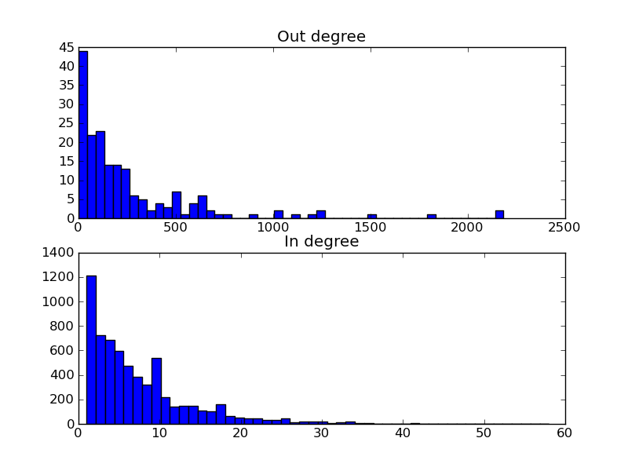

In/out-degree distribution of a transcriptional network
=======================================================

Network properties can helps us to get a feeling for the overall architecture
and structure of a certain system. One of the most informative properties is
the in/out-degree distribution of the nodes of a network. These distributions describe 
the number of outgoing and incoming links of the various nodes in the network. 

For the yeast transcriptional network, such information can tell us if there
are large hubs in the network, if the network is scale-free or not, what
number of regulators a gene commonly has (and if there are exceptions), and so
on. Also, it can highlight exceptions, e.g. genes that regulate many other
genes, or genes that are regulated by many transcription factors. 

In this example, we will do a very simple analysis to determine the in/out
degree distribution of the yeast transcriptional network. 

Importing the data
~~~~~~~~~~~~~~~~~~
First, we obtain regulation data from www.yeastract.com > Flat Files > RegulationTwoColumnTable.
This data contains protein-DNA interactions that have been curated from literature. 

To get the data into Ibidas we perform the following operations::

    >>> url = "http://www.yeastract.com/download/RegulationTwoColumnTable_Documented_20101213.tsv.gz"
    >>> yeastract = Read(Fetch(url))

``Fetch`` is an operation that takes a url, downloads the file to the data directory (default ~/.ibidas/data/),
assigns it a file name, and returns this filename. Executing ``Fetch`` on this url again will just return the filename of the
cached local copy. 

``Read`` takes this filename, and imports the data. By default it assumes a comma/tab/other symbol separated value file. 
It will attempt to detect the column delimiter, availability of fieldnames and existence of comment lines automatically. 

After these two operations, the contents of yeastract look like this::    
    >>> yeastract
    Slices: | f0       | f1      
    -----------------------------
    Type:   | bytes[7] | bytes[9]
    Dims:   | d1:48082 | d1:48082
    Data:   |          |         
            | Abf1     | YKL112w 
            | Abf1     | YAL054c 
            | Abf1     | YGL234w 
            | ...      | ...

Note that this file does not have fieldnames, so they are assigned automatically. The left column (slice ``f0``) contains transcription factors, 
while the right column (slice ``f1``) contains the targets. Note that transcription factor `Abf` is repeated multiple times in this file, 
as it has multiple targets. 

Data sections, such as ``f0`` and ``f1``, in which each data element has a similar role, are in Ibidas referred to
as 'slices'. Slices are generalizations of the column in a table, as they support more complicated data structures. 
In this example however, the slices are just regular table columns. 

Looking at the types of both slices, we see that this has been detected as the ``bytes`` type. 
Furthermore, the ``bytes`` type has an extra specifier ``[7]``, indicating that this is the maximum length of the entries in the corresponding slice.

.. tip:: the ``bytes`` type corresponds to the default ``str`` type in Python 2.x. In Python 3.0 the default string type has become
   unicode, and ``str`` has been renamed to ``bytes``. In Ibidas we use the same naming scheme: ``bytes`` for the old str type, and
   ``string`` for unicode strings. 

The third attribute, Dims, describes the structure of the data in a slice. Both slices have a single dimension: ''d1''. 
This means that the data is structured as a `vector`. A slice without dimensions would correspond to a `scalar` value, 
while a slice with two dimensions would correspond to a `matrix` structure. 

That both slices share the same dimension ``d1``, indicates that the shape and ordering of 
elements in both slices are shared. The ``:48082`` describes the length of the dimension. Thus, the complete table
has 48082 rows.

Assigning suitable names
^^^^^^^^^^^^^^^^^^^^^^^^

Of course, we would like some more meaningful names::
    
    >>> yeastract = yeastract.Rename('trans_factor','target')
    >>> yeastract = yeastract.DimRename('tftargets')
    >>> yeastract
    Slices: | trans_factor    | target
    -------------------------------------------
    Type:   | bytes[7]        | bytes[9]
    Dims:   | tftargets:48082 | tftargets:48082
    Data:   |                 |
            | Abf1            | YKL112w
            | Abf1            | YAL054c
            | Abf1            | YGL234w
            | ...             | ...

.. tip:: Operations in Ibidas start with an uppercase letter. This is done to separate them from
   slice names and dimension names, which have to be in lower case. I.e. data.count would refer to the slice count, while
   data.Count refers to the operation ``Count``.

Note that renaming is an often used operation. For that reason, there are shortcuts::

    >>> yeastract = yeastract/('trans_factor','target')

A similar shortcut for dimension renaming uses the modulo operator ('%'). 

Renaming slices and dimensions for imported data is not always necessary, as many data sources supply suitable builtin names. 
For example, databases have a table name that can be used as dimension name, and column names that can be used as a slice names.

You might have found that there is a very small delay before the contents are printed. The reason for this is the lazy nature of 
Ibidas. That is, Read and all subsequent operations are not executed immediately, but only when asked for results. The reason
for this is that it allows for improved optimizations. For example, in case the data source is a database, it allows us to translate operations
into SQL. 

In this case however, we would like to perform all operations and store their result. For that purpose, there is the operation ``Copy``::

    >>> yeastract = yeastract.Copy()

This finishes the data import. 

Predefined data sources
~~~~~~~~~~~~~~~~~~~~~~~

Before actually using the transcription factor data, we make a sidestep. Performing the actions we just did each time you want to load
the yeastract data source is a bit cumbersome. For this reason, Ibidas allows the defenition of predefined data source loading functions.

For yeastract we have added just such a function which performs the actions we have just gone through. So instead of performing those
operations, we could also just execute::
    
    >>> yeastract = Get.yeast.yeastract()

The data source functions are found in ibidas/pre.py. One can easily add new data sources. For example, 
adding the yeastract data resource yourself, would have required the following code::

    from ibidas import *

    def yeastract(url="http://www.yeastract.com/download/RegulationTwoColumnTable_Documented_20101213.tsv.gz"):
        """Downloads documented transcription factor regulation interactions from yeastract"""

        res = Read(Fetch(url),dtype="[tftargets:*]<(trans_factor=bytes, target=bytes)")
        return res.Copy()

    Get.register(yeastract, organism="yeast")

This can be simply put into a file which can then be imported when needed. These functions can also be shared with others.
In fact, if it is a public data resource, one is encouraged to submit it for inclusion into Ibidas itself. 

.. note::
   In the implementation as shown, we took a slightly different approach to specifiying slice names and dimension names then used
   in the previous section. Here, we specify it through the data type. Specifically, it reads as having an array ``[tftargets:*]`` 
   of unspecified size,  with as elements ``(trans_factor=bytes, target=bytes)`` tuples of ``trans_factor`` and ``target`` fields, 
   both with type ``bytes``. This array of tuples is automatically unpacked into the structure we encountered in the previous section.
   By specifying the whole type at forehand, no automatic type detection is needed when loading the file. 

Grouping
~~~~~~~~

To calculate the in/out-degree of the network, we have to determine the number of transcription factors per common target and the number of targets per transcription factor.

For this, we will use the GroupBy operation. First, to show what the GroupBy operation does, we will Group the data on the 
transcription factors::

    >>> gyeastract = yeastract.GroupBy(_.trans_factor)
    >>> gyeastract
    Slices: | trans_factor    | target                                                                        
    ----------------------------------------------------------------------------------------------------------
    Type:   | bytes           | bytes                                                                         
    Dims:   | gtrans_factor:* | gtrans_factor:*<gtftargets:~                                                  
    Data:   |                 |                                                                               
            | Hir2            | [YDR101c YKL109w YBR009c YNL030w YBR010w YNL031c YKL110c YGR233c YDR103w;  YG~
            | Zap1            | [YMR120c YGL256w YOR134w YNL336w YBR302c YML132w YFL062w YGR295c YHL048w;  YD~
            | Pip2            | [YPR128c YML042w YNR001c YOR100c YOR180c YLR284c YER015w YKR009c YLR174w;  YO~
            | ...             | ... 

.. note::
    Note that we could also have written the command as::

        >>> gyeastract = yeastract.GroupBy(yeastract.trans_factor)

    Attribute access is used to obtain single slices. However, this quickly becomes cumbersome in large expressions with multiple operations. Therefore,
    we use what we call a `context` operator _.  This operator functions as replacement for the enclosing data object. We will show more uses of this operator
    further on. 

After grouping on transcription factors, each transcription factor has a single row. All
targets corresponding to the transcription factor have been gathered in a nested array. This is reflected 
in the metadata. Although the types of the slices are still the same, the dimensions have changed. 

Slice ``trans_factor`` has a new dimension, called `gtrans_factor:*`. This name is made from concatenating `g` (from group) with the
name of the slice on which we performed the grouping. We see that the shape ``*`` is undefined. This is because at forehand, 
it was not known how many rows this operation would return. 

Slice ``target`` now similarly has the `gtrans_factor:*` dimension, but it also has an extra dimension `gtftargets:~`. The grouping
transformed the `tftargets` dimension into a nested array. 

The `gftargets` dimension is a so-called `dependent dimension` (in contrast to `fixed dimensions`). A `dependent
dimension` depends on a parent dimension, varying its length along this parent dimension. In this case, the lengths 
of the nested arrays per transcription factor are variable. This is indicated
by the shape parameter `~`. 

Dependent dimensions allow us to handle nested data and multi-dimensional data in a similar way. 

Calculating in/out degree
~~~~~~~~~~~~~~~~~~~~~~~~~

Now, to obtain the out-degree of the transcription factors, we simply have to count the size of the nested arrays::
    >>> gyeastract = gyeastract.Get(_.trans_factor, _.target.Count()/"out_degree")
    Slices: | trans_factor    | out_degree
    -------------------------------------------
    Type:   | bytes           | int64
    Dims:   | gtrans_factor:* | gtrans_factor:*
    Data:   |                 |
            | Hir2            | 68
            | Zap1            | 185
            | Pip2            | 150
            | ...             | ...

Here, we introduce two new operations, ``Get`` and ``Count``. Starting with the last one, ``Count`` is an aggregation operator which takes
the last dimension, and counts the number of elements in it. We subsequently call the resulting slice ``out_degree``. 
Note that its second dimension has been collapsed into the count. 

The ``Get`` function is similar to the SELECT phrase in SQL. It allows one to select some slices from a dataset, perform on some of them operations, 
and then returns the combined object. As is shown, it accepts (among other things) context operators to specifiy which slices should be selected and 
which actions performed. 

Now, if we want to plot this distribution we can make use of the package ``matplotlib`` (available for install in virtually all linux distributions). 
For that, we have to get the data out of the data object. This can be very simply done by making the query a call by adding ``()`` to it::
    
    >>> from matplotlib.pylab import *
    >>> hist(gyeastract.out_degree())
    >>> show()

Now, to plot the in-degree distribution we can do something similar. 

Summary
~~~~~~~

The total script becomes::

    >>> from matplotlib.pylab import *
    >>> yeastract = Get.yeast.yeastract()

    >>> subplot(211)
    >>> hist(yeastract.GroupBy(_.trans_factor).target.Count()(), bins=50)
    >>> title('Out degree')

    >>> subplot(212)
    >>> hist(yeastract.GroupBy(_.target).trans_factor.Count()(), bins=50)
    >>> title('In degree')

    >>> show()

Resulting in the following image:

