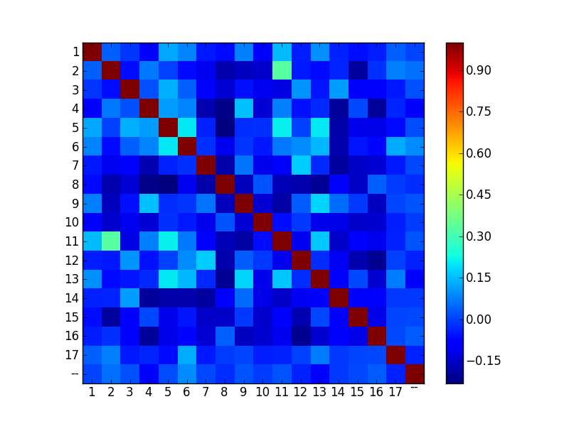
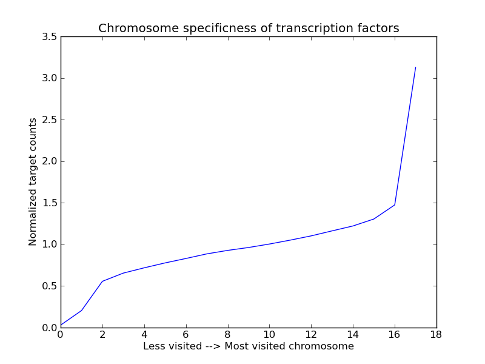

Chromosome distribution
=======================

In this example, we will analyze the genomic locations of transcription factor targets, to determine if transription 
factors favor specific chromosomes. Also, we will compare transcription factors on the chromosomes they target, to see if there are transcription
factors that target similar sets of chromosomes. Likewise, we will compare chromosomes, to see if there are chromosomes that attract common
transcription factors. 

Importing the data
~~~~~~~~~~~~~~~~~~
We will use the transcription factor data that has been imported in the previous example. The same data 
can be obtained directly using::

    >>> yeastract = Get.yeast.yeastract()

Next to this transcription factor data, we also need the location of all genes on the chromosomes.
This information can be found in the ``SGD_features.tab``, which can be obtained from yeastgenome.org. 

Unfortunately, similar to yeastract, also this file comes without fieldnames, so we specify those through the type::

    rtype = """[feats:*]<(sgdid=bytes, feat_type=bytes, feat_qual=bytes, feat_name=bytes, gene_name=bytes, 
                          gene_aliases=bytes, feat_parent_name=bytes, sgdid_alias=bytes, chromosome=bytes, 
                          start=bytes, stop=bytes, strand=bytes[1], genetic_pos=bytes, coordinate_version=bytes[10], 
                          sequence_version=bytes, description=bytes)"""

    res = Read(Fetch("http://downloads.yeastgenome.org/chromosomal_feature/SGD_features.tab"),dtype=rtype)

Note that, instead of specifying the type, we could also just have named the slicees that were needed, for example using::

    res = res/{'f3': 'feat_name', 'f8':'chromosome', 'f9':'start'}

This would rename field 3, 8 and 9 (starting from 0!). 

Type casting
^^^^^^^^^^^^
While not all fields will be used in this example, for the purpose of the tutorial we will attempt to prepare the whole dataset for easy use. 

First, when reading a file like this one, all input data is in string(bytes) format. For some slices this is not the ideal format.
Therefore, we change the types of certain slices from ``bytes`` to ``int`` and ``real`` types. This is an operation that is known as casting::

    res = res.To(_.start, _.stop, Do=_.Cast("int?"))
    res = res.To(_.genetic_pos,   Do=_.Cast("real64?"))

``To`` is a utility function, which allow one to apply other operations to a subselection 
of the slices in a data set. In this case, we cast the ``start`` and ``stop`` slice to an integer type, and the ``genetic_pos``
slice to a double floating point type. Note that we do specify ``int?``, i.e. with a
question mark sign. The indicates that missing values (empty fields) are allowed. 

.. note:: 
    Maybe you ask yourself why we do not use the following approach::
        
        >>> res.genetic_pos = res.genetic_pos.Cast("real64?")

    The reason is that res could have been used in another query before executing this command. Changing res by 
    performing this operation would therefore lead to some problems because of the lazy nature of query execution in Ibidas.
    It might be possible to allow this in the future, however it would require some trickery/overhead. So, for now, we use the approach
    with the ``To`` operation.
    

Applying a regular Python function and filtering
^^^^^^^^^^^^^^^^^^^^^^^^^^^^^^^^^^^^^^^^^^^^^^^^

Next, we take a look at the ``gene_aliases`` slice, which contains multiple gene aliases separated by the '|' symbol.
We would like to split these strings into individual names, and remove the empty names. For the split operation, we 
use the standard Python split function. The whole expression becomes::

    >>> splitfunc = _.split('|')
    >>> res.gene_aliases.Each(splitfunc).Elems()[_ != ""]

`splitfunc` is here a context operator based expression, which can be applied to a string in order to split it. 

``Each`` applies a regular python function or a context object to each element in a slice. The slice returning from this has 
in this case as type lists of strings, as that is the output of the splitfunc operation. 

``Elems`` `unpacks` this resulting list of names, such that subsequent operations will be performed on the list elements instead of the list itself. 

``Filter``, denoted by the `[]`, only keeps elements (denoted by the context operator) that are unequal to the empty string. 

.. note::
    Note that Ibidas cannot know what type will result from the function used in the ``Each`` operation. For that reason it will automatically
    perform type detection when necessary for subsequent operations. It is possible to prevent this by specifying the type at forehand. 
    Also, instead of the context operation one can use regular python functions, which (at the moment) execute slightly faster::
        
        >>> splitfunc = lambda x: x.split('|')
        >>> dtype = "[aliases:~]<bytes"
        >>> res.gene_aliases.Each(splitfunc, dtype=dtype).Elems()[_ != ""]

    (lambda allows one to define anonymous functions in Python)

To make these modified gene_aliases slice part of the dataset, we apply them again using the ``To`` function, and store the results using ``Copy``::

    splitfilter = _.Each(splitfunc, dtype=dtype).Elems()[_ != ""]
    yeast_feats = res.To(_.gene_aliases, Do=splitfilter).Copy()

Short version
^^^^^^^^^^^^^

To obtain both datasets directly, use::

    yeast_feats = Get.yeast.genomic_feats()
    yeastract = Get.yeast.yeastract()

Linking the datasets
~~~~~~~~~~~~~~~~~~~~

Now, we have to link both the yeastract dataset and the genomic features dataset. This is done by matching the ``targets`` in the Yeastract dataset 
with the ``feat_name`` slice in the genomic features dataset. This can be accomplished using the ``Match`` operation, which links rows in two datasets
based on equality of the entries in two slices.

For example, we could use::

    >>> tf_feat = yeastract |Match(_.target, _.feat_name)| yeast_feats

to match both datasets on their target and feat_name slice. 

However, there is the small problem that both datasets have different upper/lowercase usage, due to which
most target and feat_name names do not match with each other. 

So, instead, we convert each target and feat_name to upper case before matching::
    
    >>> tf_feat = yeastract |Match(_.target.Each(str.upper), _.feat_name.Each(str.upper))| yeast_feats
    >>> tf_feat  #only showing a few slices...
    Slices: | trans_factor      | target            | sgdid             | feat_type         | feat_qual        
    -----------------------------------------------------------------------------------------------------------
    Type:   | bytes             | bytes             | bytes             | bytes             | bytes            
    Dims:   | yeastract_feats:* | yeastract_feats:* | yeastract_feats:* | yeastract_feats:* | yeastract_feats:*
    Data:   |                   |                   |                   |                   |                  
            | Gcr2              | YAL008w           | S000000006        | ORF               | Verified         
            | Met4              | YAL008w           | S000000006        | ORF               | Verified         
            | Otu1              | YAL008w           | S000000006        | ORF               | Verified
            | ...               | ...               | ...               | ...               | ...

When using a regular ``Match`` operation, any ``target`` row for which no entry can be found in ``feat_name`` will be left out, and vice versa (there are options to prevent this). 

Sidestep: Checking what is linked
^^^^^^^^^^^^^^^^^^^^^^^^^^^^^^^^^
The linking of both datasets is now complete. In this section, we will determine which elements  could not be linked, and see if we can do better. 
These steps are performed just to introduce some commands and concepts, and are not necessary to complete the example.   

First, we do a quick check to determine how many rows in the yeastract dataset could not be matched. A naive approach to this would be::
    
    >>> yeastract.target.Count() - tf_feat.target.Count()
    Slices: | target
    ----------------
    Type:   | int64 
    Dims:   |       
    Data:   |       
            | 72

On a total of 48010 pairs, it appears thus that we lost only a few transcription factor-target pairs. 

This assumes however that `yeast_feats` did not have any non-unique names in `feat_name`, as repeated names will match multiple times to the
same entry in yeastract, and thus increases the number of entries. As an illustration, say we have::

    >>> d1 = Rep([1,2,3,3])
    >>> d2 = Rep([1,3,3])
    >>> d1 |Match| d2
    Slices: | data
    ---------------
    Type:   | int64
    Dims:   | d1:*
    Data:   |
            | 1
            | 3
            | 3
            | 3
            | 3

Thus, two rows with 3's match in ``d1`` match each to two rows of 3's in ``d2``, resulting in 2 * 2 rows of 3's in the output. 

It is easy to determine that `yeast_feats` does not have such non-unique names, using::

    >>> yeast_feats.feat_name[_ != ""].Get(_.Count() == _.Unique().Count())
    Slices: | feat_name
    -------------------
    Type:   | bool     
    Dims:   |          
    Data:   |          
            | True

This command removes the empty feat_names (which do not occur in `yeastract`), and then counts the remaining feat_names, and compares this to a count of the remaining unique feat_names.

However, even a better approach is to circumvent this extra assumption, by checking if the rows in yeastract do actually occur in tf_feat::

    >>> (yeastract |Except| tf_feat.Get(_.trans_factor, _.target)).Count()
    Slices: | trans_factor | target
    -------------------------------
    Type:   | int64        | int64
    Dims:   |              |
    Data:   |              |
            | 72           | 72

This introduces the ``Except`` command. This command only keeps rows of yeastract that do not occur in tf_feat. These rows are subsequently counted. Note that this gives the same answer as 
we had before. 

A shorter version of this command, that also scales to cases in which `yeastract` has many slices, is the following::
    >>> (yeastract |Except| tf_feat.Get(*yeastract.Names)).Count()

Next, we determine which target names could not matched::

    >>> nonmatched = yeastract.target |Except| tf_feat.target
    >>> nonmatched.Show()
    Slices: | target                       
    ---------------------------------------
    Type:   | bytes                        
    Dims:   | syeastract_syeastract_feats:*
    Data:   |                              
            | YLR157w-c                    
            | A1                           
            | YJL012c-a                    
            | MALT                         
            | MALS                         
            | snR20                        
            | A2                           
            | YAR044w                      
            | RDN5                         
            | YJL017w                      
            | ALD1                         
            | YGR272c                      
            | YBL101w-b                    
            | YBL101w-c                    
            | YDL038c                      
            | YBL101w-a                    
            | TER1                         
            | SUC6                         
            | YDR524w-a                    
            | YDR474c                      
            | YBR075w                      
            | DEX2  

Using ``Except``, we keep only the targets in yeastract that do not occur in ``tf_feat.target``. Another lower level way to accomplish the same result
would be::
    
    >>> non_matched = (yeastract.target.Set() - tf_feat.target.Set()).Elem()

``Set`` is used to pack the elements of the (by default last) dimension into a set. A set is a collection of objects
in which each element is unique. That is, adding the string "YLR157W-C" multiple times to a set will result in a set with just one occurence of "YLR157W-C".
Sets have some special operations defined on them. One of them is set substraction, which was used here. It removes all elements in the set of the first operand that
also occur in the set of the second operand, leaving only the elements that do not occur in the second operand. In this case thus the elements that were not matched by the Match operation. 
Next, we use the ``Elem`` operation to unpack the resulting set. 

The names in the list suggest that we might find matching rows by looking either at the ``gene_name`` or ``gene_aliases`` column of the `yeast_feats` dataset
Before we do this, we first convert each name in nonmatched to uppercase::
    
    >>> nonmatched = nonmatched.Each(str.upper)

First, we check the ``gene_name`` column. This does not give any matches however::
    
    >>> nonmatched |In| yeast_feats.gene_name.Each(str.upper)
    Slices: | result             
    -----------------------------
    Type:   | bool               
    Dims:   | stftargets_sfeats:*
    Data:   |                    
            | False              
            | False              
            | False 
            | ...
    
(Use Show() to see the whole result). This introduces the ``In`` operation, which determines if elements in the left operand occur in the (by default last) dimension of the right operand. 

Next we look at the gene_aliases column. As you might remember this slice does contain nested arrays of aliases. So what will ``|In|`` return here?::

    >>> nonmatched.Each(str.upper) |In| yeast_feats.gene_aliases.Each(str.upper)
    Slices: | result                                    
    ----------------------------------------------------
    Type:   | bool                                      
    Dims:   | stftargets_sfeats:*<feats:*               
    Data:   |                                           
            | [False False False ..., False False False]
            | [False False False ..., False False False]
            | [False False False ..., False False False]
            | ...      

As you can see, ``|In|`` matches with the last dimension of ``gene_aliases``. This means that there are multiple aliases list to be matched, which together with
the multiple names to be tested results in a matrix of results, of size(non_matched) by size(yeast_feats). Of course, this is not what we exactly want. We can solve this using ``Any``::
    
    >>> Any(nonmatched |In| yeast_feats.gene_aliases.Each(str.upper))
    Slices: | result
    -----------------------------
    Type:   | bool
    Dims:   | stftargets_sfeats:*
    Data:   |
            | True
            | True
            | True
            | ...

This aggregates across the ``feats`` dimension, to determine if any of the features had any alias that matched something in our list. Indeed, we found
matches for the targets.

We will use the Match function to find which genes match to these non-matched targets (we could also have done this directly of course, but that would have prevented us from introducing some operations). 
Using Flat, we flatten the gene alias list, and then apply Match as we did before::

    >>> nonmatched_feats = nonmatched |Match(_.target, _.gene_aliases.Each(str.upper))| yeast_feats.Flat()
    >>> nonmatched_feats
    Slices: | target                          | sgdid                           | feat_type                       | feat_qual                       | feat_name                      
    ---------------------------------------------------------------------------------------------------------------------------------------------------------------------------------
    Type:   | bytes[11]                       | bytes                           | bytes                           | bytes                           | bytes[11]                      
    Dims:   | stftargets_sfeats_feats_falias~ | stftargets_sfeats_feats_falias~ | stftargets_sfeats_feats_falias~ | stftargets_sfeats_feats_falias~ | stftargets_sfeats_feats_falias~
    Data:   |                                 |                                 |                                 |                                 |                                
            | YLR157W-C                       | S000028678                      | ORF                             | Uncharacterized                 | YLR157W-E                      
            | YAR044W                         | S000000081                      | ORF                             | Verified                        | YAR042W                        
            | YBL101W-C                       | S000028598                      | ORF                             | Uncharacterized                 | YBL100W-C                      
            | YBL101W-A                       | S000002148                      | transposable_element_gene       |                                 | YBL100W-A                      
            | YJL017W                         | S000003553                      | ORF                             | Uncharacterized                 | YJL016W                        
            | A1                              | S000029660                      | not in systematic sequence of ~ |                                 | MATA1                          
            | YJL012C-A                       | S000003549                      | ORF                             | Verified                        | YJL012C                        
            | MALT                            | S000000502                      | ORF                             | Verified                        | YBR298C                        
            | MALT                            | S000003521                      | ORF                             | Verified                        | YGR289C                        
            | MALT                            | S000029681                      | not in systematic sequence of ~ |                                 | MAL21                          
            | MALT                            | S000029686                      | not in systematic sequence of ~ |                                 | MAL41                          
            | MALT                            | S000029658                      | not in systematic sequence of ~ |                                 | MAL61                          
            | MALS                            | S000000503                      | ORF                             | Verified                        | YBR299W                        
            | MALS                            | S000003524                      | ORF                             | Verified                        | YGR292W                        
            | ...                             | ...                             | ...                             | ...                             | ...    

This shows a possible reason why some of these targets do not have an offical name, as they match to multiple genomic features. However, other targets
only have a single corresonding genomic feature, and could have been linked. To improve our mapping, we decide to redo our match, and include rows 
that have a unique ``gene_alias`` match. Our strategy is as follows:

1. Filter out gene_aliases that occur multiple times, as we only want unique matches
2. Convert yeastract targets names that match to gene_aliases to the corresponding feat_names
3. Rematch the data. 

First, we determine what names need to be filtered, and filter these from the gene_aliases::
    >>> unique_gene_aliases = yeast_feats.Flat().GroupBy(_.gene_aliases)[Count(_.feat_name) == 1].gene_aliases

    >>> name_alias_list = yeast_feats[_.gene_aliases |In| unique_gene_aliases]

The first command flattens the nested gene_alias lists, to get a flat table (If there were would have been more than one nested list 
dimension, we would have had to specify `yeast_feats.Flat(_.gene_aliases)`). 

Next, we group the data on common gene_aliases, and then remove those gene_aliases that have more than more than one associated feat_name. 

Subsequently, we filter the yeast_feats table, such that we only keep the gene_aliases that are in the list of unique gene aliases. 

In the second step, we convert the yeastract names that occur in the gene_aliases. This can be done using the ``TakeFrom`` command::
    >>> convert_table = name_alias_list.Get(_.gene_aliases.Each(str.upper), _.feat_name).Flat()
    
    >>> yeastract = yeastract.To(_.target, Do=_.Each(str.upper).TakeFrom(convert_table, keep_missing=True))

The TakeFrom command takes a two-slice table (convert_table), and converts the target names that occur in the first slice of the 
table to the names of the second slice of the table.  We set keep_missing to true, to also keep the names that do not occur in the
gene_aliases. 

Now we can redo our match, as we did before::
    >>> tf_feat = yeastract |Match(_.target.Each(str.upper), _.feat_name.Each(str.upper))| yeast_feats

Counting again the number of yeastract rows that could be matched, we find::
    >>> (yeastract |Except| tf_feat.Get(*yeastract.Names)).Count()
    Slices: | trans_factor | target
    -------------------------------
    Type:   | int64        | int64
    Dims:   |              |
    Data:   |              |
            | 6            | 6

Thus, 72 - 6 = 66 additional rows in yeastract have been matched. 

Short version
^^^^^^^^^^^^^

To obtain directly the results of the last section, do::

    #remove non-unique gene_aliases
    >>> name_alias_list = yeast_feats[_.gene_aliases |In| _.Flat().GroupBy(_.gene_aliases)[Count(_.feat_name) == 1].gene_aliases]
    
    #convert yeastract target names that match to gene_aliases, to the corresponding feat_names
    >>> convert_table = name_alias_list.Get(_.gene_aliases.Each(str.upper), _.feat_name).Flat()
    >>> yeastract = yeastract.To(_.target, Do=_.Each(str.upper).TakeFrom(convert_table, keep_missing=True))

    >>> tf_feat = yeastract |Match(_.target.Each(str.upper), _.feat_name.Each(str.upper))| yeast_feats

Save dataset
~~~~~~~~~~~~

First, we save the current dataset. This can be done using::

    >>> Save(tf_feat, 'tf_feat.dat')

The data can be loaded again using::

    >>> tf_feat = Load('tf_feat.dat')

Chromosome distribution
~~~~~~~~~~~~~~~~~~~~~~~
We start with determining for each transcription factor the number of targets per chromosome. To do this, we use a two-dimensional group, grouping both on transcription factor
and chromosome, and counting the number of targets per transcription_factor / chromosome pair::

    >>> tf_feat = tf_feat.GroupBy(_.trans_factor, _.chromosome)
    >>> res = tf_feat.Get(_.trans_factor, _.chromosome, _.target.Count()/"count", _.start).Copy()
    >>> res
    Slices: | trans_factor    | chromosome    | count                                                     | start                                                    
    -----------------------------------------------------------------------------------------------------------------------------------------------------------------
    Type:   | bytes           | bytes         | int64                                                     | int64?                                                   
    Dims:   | gtrans_factor:* | gchromosome:* | gtrans_factor:*<gchromosome:*                             | gtrans_factor:*<gchromosome:*<gyeastract_feats:~         
    Data:   |                 |               |                                                           |                                                          
            | Gcr2            | 1             | [17 48 60 37 40 32 24 31 80 48 29 52 16 42  8 32]         | [ [136914 36509 2169 186321 21566 31567 222406 221049 92~
            | Met4            | 2             | [ 23  92 100  78  89  61  54  85 165 110  69 110  37  96~ | [ [136914 130799 74020 67520 21566 58462 31567 151166 39~
            | Otu1            | 7             | [ 4 11  9  5  2  1  4  5 11  6  2  4  8  0  0  7]         | [[136914 135665 110430 158619];  [278352 568426 738369 6~
            | Cin5            | 16            | [10 37 54 40 50 38 23 24 67 57 28 65  8 47  9 32]         | [[73518 169375 74020 58462 45022 190193 129270 71786 334~
            | Gcn4            | 10            | [ 22  92 108  92  94  73  49  84 154  97  68 106  24 104~ | [ [169375 36509 192619 130799 67520 203403 58462 54789 4~
            | Zap1            | 11            | [ 4 13 22 10 11 10  2 13 19 17  9 14 12 19  3  7]         | [[186321 151166 99697 155005];  [724456 686901 382030 81~
            | Yap7            | 9             | [ 2 13 11 12 14 15  2 11 30 19 15 12  4 13  3  8]         | [[130799 119541];  [724456 168423 583720 582652 331511 7~
            | Ste12           | 14            | [ 37 153 215 158 129 113  93 131 227 200  93 182  70 159~ | [ [169375 164187 92270 192619 67520 21566 69525 203403 1~
            | Arr1            | 4             | [ 4  1 85 87 51 54 28 76  4 90 52 97  6 81 26  1]         | [[31567 222406 120225 119541] [316968];  [828625 87981 4~
            | Aft2            | 12            | [ 1 15 20 11  9  8  6 14 22 25  9 18  2 14  6 13]         | [[110430];  [382030 633622 447709 635146 393123 426489 5~
            | Ecm22           | 8             | [ 6 15 25 33 22 13 13 17 31 27 13 17  4 11  6 17]         | [[94687 218140 2169 186321 220198 177023];  [444693 7144~
            | Ino4            | 15            | [ 7 40 69 49 38 22 26 53 86 45 43 61 24 40  7 27]         | [[94687 21566 69525 45022 71786 13743 45899];  [13879 31~
            | Aft1            | 3             | [ 22  75 114  82  72  53  50  71 127  87  65 104  26  94~ | [ [36509 87031 129019 203403 31567 222406 45022 190193 1~
            | Sok2            | 13            | [ 31  62  98  68  62  51  54  69  97  58  70 109  24  72~ | [ [218140 164187 92270 82706 192619 67520 21566 175135 6~
            | ...             | ...           | ...                                                       | ...      

Note that each slice has now a different dimension. Trans_factor and chromosome both have a single dimension, with all unique values. The count slice contains a matrix, 
with counts for each transcription_factor/chromosome pair, and ``start`` contains for each transcription factor/chromosome pair a list of all gene start positions.

To calculate now a correlation correlation between transcription factors, based on if they target the same chromosomes, we can simply do::

    >>> Corr(res.count)

However, the resulting correlations are positively biased as we did not control for the different numbers of genes on each chromosome.
To normalize the count data, we divide by the total number of targets per chromosome::
    
    >>> Corr(res.count.Cast("real64") / res.count.Sum("gtrans_factor").count)
    Slices: | count                                                                                                                                                  
    -----------------------------------------------------------------------------------------------------------------------------------------------------------------
    Type:   | real64                                                                                                                                                 
    Dims:   | gtrans_factor:*<gtrans_factor:*                                                                                                                        
    Data:   |                                                                                                                                                        
            | [ 1.          0.84058821  0.56884259  0.46862953  0.75701405  0.60343542;   0.54598067  0.78050323  0.1699565   0.39857328  0.695562    0.63384689;   ~
            | [ 0.84058821  1.          0.34636467  0.40345917  0.86052624  0.61812576;   0.68426206  0.92512018  0.45395797  0.67508341  0.72107807  0.78040341;   ~
            | [ 0.56884259  0.34636467  1.         -0.15274769  0.07486133  0.58630083;  -0.02208724  0.38574002 -0.41424377 -0.10392024  0.22757454  0.38601169;   ~
            | [ 0.46862953  0.40345917 -0.15274769  1.          0.71668069  0.07167468;   0.42931201  0.35479816  0.32588663  0.34150679  0.43178954  0.21771547;   ~
            | [ 0.75701405  0.86052624  0.07486133  0.71668069  1.          0.40977524;   0.70526491  0.78290387  0.52340019  0.64076449  0.73000811  0.62646315;   ~
            | [ 0.60343542  0.61812576  0.58630083  0.07167468  0.40977524  1.;   0.48239639  0.64139371  0.21699255  0.25563464  0.22584824  0.6321228;   0.5578196~
            | [ 0.54598067  0.68426206 -0.02208724  0.42931201  0.70526491  0.48239639;   1.          0.54775513  0.41362316  0.54245825  0.47982939  0.57266579;   ~
            | [ 0.78050323  0.92512018  0.38574002  0.35479816  0.78290387  0.64139371;   0.54775513  1.          0.48832401  0.73255135  0.74640988  0.70272516;   ~
            | [ 0.1699565   0.45395797 -0.41424377  0.32588663  0.52340019  0.21699255;   0.41362316  0.48832401  1.          0.54753551  0.45464972  0.41855642;   ~
            | [ 0.39857328  0.67508341 -0.10392024  0.34150679  0.64076449  0.25563464;   0.54245825  0.73255135  0.54753551  1.          0.53611385  0.49655451;   ~
            | [ 0.695562    0.72107807  0.22757454  0.43178954  0.73000811  0.22584824;   0.47982939  0.74640988  0.45464972  0.53611385  1.          0.54252082;   ~
            | [ 0.63384689  0.78040341  0.38601169  0.21771547  0.62646315  0.6321228;   0.57266579  0.70272516  0.41855642  0.49655451  0.54252082  1.;   0.7725603~
            | [ 0.84629762  0.94229773  0.2511703   0.4532385   0.8736701   0.55781963;   0.6038615   0.89819293  0.58601108  0.64679905  0.75517794  0.77256031;   ~
            | [ 0.73136577  0.58847393  0.41657058  0.49813967  0.64892351  0.26202592;   0.24997758  0.5509231   0.13508773  0.25581194  0.58083685  0.46142624;   ~
            | ...                                  

Note that we first cast to double, as integer division will only result in whole integers. We sum along the `gtrans_factor` dimension to determine the number of targets
per chromosome. The division operator knows on which dimension it should divide and how it should broadcast, as it can use the dimension identities. 

As you can see, a square matrix is calculated with all correlation coefficients. What if we now want to calculate a correlation between chromosomes instead? We
first normalize by dividing by the total targets per transcription factor, and then perform the correlation on the transposed matrix::

    >>> chr_normtf = res.To(_.count, Do=_.Cast("real64") / _.count.Sum("gchromosome"))
    >>> Corr(chr_normtf.count.Transpose())
    Slices: | count                                                                                                                     
    ------------------------------------------------------------------------------------------------------------------------------------
    Type:   | real64                                                                                                                    
    Dims:   | gchromosome:*<gchromosome:*                                                                                               
    Data:   |                                                                                                                           
            | [ 1.          0.03923059 -0.04462679 -0.04095488 -0.07967297  0.15137151;   0.07687509 -0.03606974 -0.07361156 -0.0433545~
            | [ 0.03923059  1.         -0.11188931 -0.01870759 -0.14574641  0.33008009;  -0.16066959 -0.03152373  0.06936447 -0.0485143~
            | [-0.04462679 -0.11188931  1.         -0.13657844 -0.11330372 -0.08524838;   0.06324146 -0.19655547 -0.17755139  0.1707482~
            | [-0.04095488 -0.01870759 -0.13657844  1.         -0.14262329 -0.10862002;  -0.16384278 -0.08640234 -0.20092264 -0.2123649~
            | [-0.07967297 -0.14574641 -0.11330372 -0.14262329  1.         -0.05929658;  -0.13892804 -0.12049258 -0.13792648 -0.0087695~
            | [ 0.15137151  0.33008009 -0.08524838 -0.10862002 -0.05929658  1.;  -0.19181151 -0.15118885  0.08037876 -0.11170856 -0.170~
            | [ 0.07687509 -0.16066959  0.06324146 -0.16384278 -0.13892804 -0.19181151;   1.          0.05264461  0.15371278  0.0332715~
            | [-0.03606974 -0.03152373 -0.19655547 -0.08640234 -0.12049258 -0.15118885;   0.05264461  1.         -0.20148438 -0.1066510~
            | [-0.07361156  0.06936447 -0.17755139 -0.20092264 -0.13792648  0.08037876;   0.15371278 -0.20148438  1.         -0.0583490~
            | [-0.04335456 -0.04851435  0.17074828 -0.21236499 -0.00876959 -0.11170856;   0.03327151 -0.10665103 -0.05834909  1.       ~
            | [-0.06679718 -0.18103018 -0.18679103  0.03853411  0.02583352 -0.17084297;  -0.16592298 -0.08229363 -0.21797934 -0.1814246~
            | [-0.06091041 -0.19461361 -0.15352177 -0.11909199 -0.15047679 -0.07791267;  -0.01086654 -0.09348471  0.01221415 -0.1780629~
            | [ 0.00375829  0.05897814  0.00921063  0.0324667  -0.00383316  0.02390791;   0.02505551 -0.01051652 -0.07514931 -0.0357086~
            | [-0.01192451 -0.06100544 -0.07468588 -0.07741828 -0.1110399  -0.1256938;  -0.05487917  0.11389759  0.02129484  0.10186774~
            | ... 

For this we use the ``Transpose`` operation, which can be used to reorder the dimensions of slices. Of course, from this matrix it is hard to identify which columns/rows correspond to which chromosome.
So we would like to order on chromosome number. As chromosome is currently a bytes type, the ``Sort`` operation would perform an alphabetic ordering. We therefore
convert chromosome to an integer (allowing for missing values, as not all genes have an associated chromosome) before sorting::

    >>> chr_normtf.Sort(_.chromosome.Cast("int?")).Get(_.chromosome, Corr(_.count.Transpose()/"chromo_corr")).Show()
    Slices: | chromosome    | chromo_corr                                                                                                                                     
    --------------------------------------------------------------------------------------------------------------------------------------------------------------------------
    Type:   | int64?        | real64?                                                                                                                                         
    Dims:   | gchromosome:* | gchromosome:*<gchromosome:*                                                                                                                     
    Data:   |               |                                                                                                                                                 
            | 1             | [1.0 0.0392305859056 -0.0119245063359 -0.0736115605627 0.126794737292;  0.0828449457975 -0.0446267914596 -0.0667971839521 0.0768750883472;  -0.~
            | 2             | [0.0392305859056 1.0 -0.0610054408293 0.069364465012 0.00176664423332;  -0.0648967053241 -0.111889306527 -0.181030176875 -0.160669588901;  -0.1~
            | 3             | [-0.0119245063359 -0.0610054408293 1.0 0.0212948400421 0.137105024317;  0.040951946291 -0.0746858789864 -0.136588616096 -0.0548791659491;  -0.1~
            | 4             | [-0.0736115605627 0.069364465012 0.0212948400421 1.0 0.109860736686;  0.0822441736783 -0.177551393828 -0.217979339847 0.153712776242;  -0.13792~
            | 5             | [0.126794737292 0.00176664423332 0.137105024317 0.109860736686 1.0;  0.203198536954 -0.0357373652455 -0.23231214159 -0.0247653270345;  -0.01625~
            | 6             | [0.0828449457975 -0.0648967053241 0.040951946291 0.0822441736783;  0.203198536954 1.0 -0.0202264350435 -0.11125475417 -0.0138921581198;  -0.047~
            | 7             | [-0.0446267914596 -0.111889306527 -0.0746858789864 -0.177551393828;  -0.0357373652455 -0.0202264350435 1.0 -0.186791033472 0.0632414609691;  -0~
            | 8             | [-0.0667971839521 -0.181030176875 -0.136588616096 -0.217979339847;  -0.23231214159 -0.11125475417 -0.186791033472 1.0 -0.165922975268;  0.02583~
            | 9             | [0.0768750883472 -0.160669588901 -0.0548791659491 0.153712776242;  -0.0247653270345 -0.0138921581198 0.0632414609691 -0.165922975268 1.0;  -0.1~
            | 10            | [-0.0796729677666 -0.145746411585 -0.111039896564 -0.137926483313;  -0.0162510011049 -0.0471924113471 -0.113303722071 0.0258335246367;  -0.1389~
            | 11            | [0.151371512687 0.330080094412 -0.12569380041 0.0803787562745;  0.215208353694 0.069267205163 -0.0852483767543 -0.170842971844;  -0.19181151482~
            | 12            | [-0.0433545580052 -0.048514346702 0.101867737225 -0.0583490943535;  0.00349728862612 0.0928809373801 0.170748282214 -0.181424654113;  0.0332715~
            | 13            | [0.0984893827189 -0.0649125722394 -0.0498315789475 -0.0299329134474;  0.201054942739 0.143592852561 -0.0271264696499 -0.205023822594;  0.179569~
            | 14            | [-0.0360697420734 -0.0315237313111 0.113897592107 -0.201484376028;  -0.187782203257 -0.182313717367 -0.196555466146 -0.0822936292235;  0.052644~
            | 15            | [-0.0609104133205 -0.194613609877 -0.0966953240163 0.0122141518555;  -0.112996020284 -0.0504902614406 -0.15352176825 -0.154372238875;  -0.01086~
            | 16            | [-0.0409548824216 -0.0187075856301 -0.0774182808418 -0.20092264034;  -0.117518827147 -0.072661793534 -0.136578435161 0.0385341077911;  -0.16384~
            | 17            | [0.0404627721039 0.078285703677 -0.0464339341667 -0.0313786020908;  -0.0676937374275 0.129106527976 -0.0483567167497 -0.00501764528626;  0.0048~
            | --            | [0.00375829063026 0.0589781371356 0.0190755740297 -0.0751493121398;  0.0134731513957 0.0904799039122 0.00921063035375 -0.0219148554581;  0.0250~

We plot the results using::
    
    res = chr_normtf.Sort(_.chromosome.Cast("int?")).Get(_.chromosome, Corr(_.count.Transpose()/"chromo_corr"))
    imshow(res.chromo_corr(), interpolation='nearest')
    xticks(Pos(res.chromosome)(), res.chromosome())
    yticks(Pos(res.chromosome)(), res.chromosome())
    colorbar()
    show()    

Transcription factor specificity
^^^^^^^^^^^^^^^^^^^^^^^^^^^^^^^^

As last step, we like to calculate to what extent transcription factors target specific chromosomes. 

First, we obtain a dataset that is normalized for counts per chromosome::
    >>> chr_normchr = res.To(_.count, Do=_.Cast("real64") / _.count.Sum("gtrans_factor"))

Next, we group for each TF the chromosome counts from low to high. Subsequently, we 
sum across the rows, for all transcription factors, to get the following result::

    >>> chr_normtf.count.Sort().Sum("gtrans_factor")
    Slices: | count          
    -------------------------
    Type:   | real64         
    Dims:   | gchromosome:*  
    Data:   |                
            | 0.0300120048019
            | 0.19843303089  
            | 0.55413076386  
            | 0.653791379541 
            | 0.718104362671 
            | 0.776878372718 
            | 0.829423749173 
            | 0.885342987674 
            | 0.927864695259 
            | 0.962609282328 
            | 1.00208988772  
            | 1.05152541613  
            | 1.1006070164   
            | 1.15928017163  
            | 1.22155081093  
            | 1.30419432548  
            | 1.50241732864  
            | 3.12174441416

It seems that indeed there is some chromosome specificness for transcription factors
(although making this a hard conclusion would probably require a permutation analysis). Try
for yourself to see if the effect persists if you remove all transcription factors with less than 20 
targets from the data. 

We plot the results using matplotlib::

    >>> from matplotlib.pylab import *
    >>> plot(normalized_counts.Sort().Sum("gtrans_factor")())
    >>> title("Chromosome specificness of transcription factors")
    >>> ylabel("Normalized target counts")
    >>> xlabel("Less visited --> Most visited chromosome")
    >>> show()

Summary
~~~~~~~
To directly get the results, do::
    
    #data import
    >>> yeast_feats = Get.yeast.genomic_feats()
    >>> yeastract = Get.yeast.yeastract()
    
    #structurize data
    >>> res = yeastract |Match(_.target.Each(str.upper), _.feat_name.Each(str.upper))| yeast_feats
    >>> res = res.GroupBy(_.trans_factor, _.chromosome)
    >>> res = res.Get(_.trans_factor, _.chromosome, _.target.Count()/"count", _.start).Copy()
    
    #tf similarity
    >>> chr_normchr = res.To(_.count, Do=_.Cast("real64") / _.count.Sum("gtrans_factor"))
    >>> chr_normchr.Get(_.trans_factor, Corr(_.count))
    
    #chromosome similarity, sorted on chromosome
    >>> chr_normtf = res.To(_.count, Do=_.Cast("real64") / _.count.Sum("gchromosome"))
    >>> chr_normtf.Sort(_.chromosome.Cast("int?")).Get(_.chromosome, Corr(_.count.Transpose()/"chromo_corr")).Show()

    #tf specificity
    >>> chr_normtf.count.Sort().Sum("gtrans_factor")

